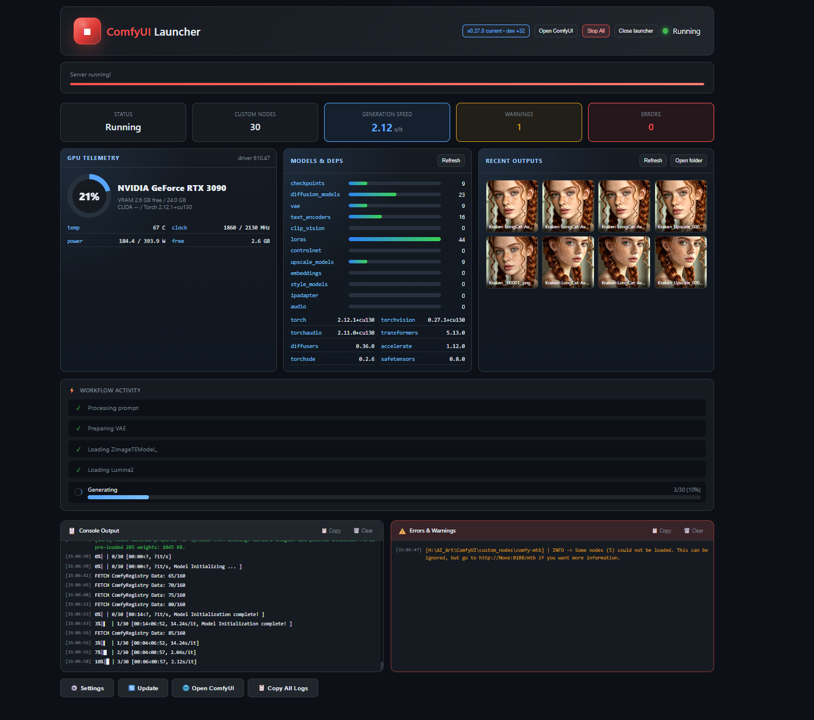
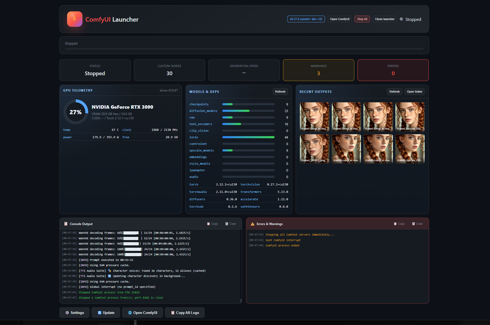

# ComfyUI Launcher

A modern, web-based graphical launcher for ComfyUI that replaces the default command prompt window with a richer dark dashboard.



## Features

- **Modern Web UI** - Clean, dark-themed interface that opens in your browser
- **Real-time Console Output** - Split view with main logs on the left and errors/warnings on the right
- **Startup Progress Tracking** - Visual progress bar showing ComfyUI loading stages
- **Stop All Control** - Immediately stops ComfyUI process trees and clears the ComfyUI port
- **Open ComfyUI Button** - Re-open the ComfyUI browser tab from the launcher
- **GPU Telemetry** - Shows GPU utilization, VRAM, temperature, clocks, power, CUDA, Torch, and driver info
- **Models & Dependencies Dashboard** - Counts model folders and shows key Python dependency versions
- **Recent Output Thumbnails** - Browse recent generated images and open the output folder
- **Workflow Activity Tracker** - See what ComfyUI is doing in real-time:
  - Loading checkpoints
  - Generating images (with progress bar)
  - VAE decoding
  - Completion time
- **Generation Speed Display** - Shows current generation speed (s/it or it/s)
- **Error/Warning Counter** - Quick visibility into issues
- **Settings Panel** - Configure listen address, port, and extra arguments
- **Update Integration** - Built-in buttons to update ComfyUI
- **Copy Logs** - One-click copy of console output for debugging
- **No External Dependencies** - Uses only Python's built-in libraries

## Screenshots

### Stopped State


### Running with Workflow Activity


### Generation Complete


### Settings Panel


## Installation

1. Download `ComfyUI_Launcher.pyw` and place it in your ComfyUI root directory (the folder containing `ComfyUI/`, `python_embeded/`, etc.)

2. Optionally, download `ComfyUI_Launcher.bat` for a convenient shortcut

Your folder structure should look like:
```
<your install folder>\              (any drive or folder)
├── ComfyUI/                        (ComfyUI source code)
├── python_embeded/                 (Embedded Python)
├── update/                         (Update scripts - optional)
├── ComfyUI_Launcher.pyw           <- Place here
└── ComfyUI_Launcher.bat           <- Place here (optional)
```

## Usage

### Option 1: Double-click the .pyw file
Simply double-click `ComfyUI_Launcher.pyw` to start the launcher.

### Option 2: Use the batch file
Double-click `ComfyUI_Launcher.bat` for a cleaner launch (no Python window).

### Option 3: Run from command line
```bash
python ComfyUI_Launcher.pyw
```

The launcher will:
1. Open a web interface at `http://127.0.0.1:8199`
2. Click "Start ComfyUI" to launch ComfyUI
3. ComfyUI will run on its configured port (default: 8188)

## Configuration

Click the **Settings** button to configure:

- **Listen Address** - Network interface to bind to (default: `0.0.0.0` for all interfaces)
- **Port** - ComfyUI server port (default: `8188`)
- **Extra Arguments** - Additional command line arguments (e.g., `--lowvram`, `--cpu`)
- **Auto-launch browser** - Automatically open ComfyUI when ready

Settings are saved to `launcher_settings.json`.

## Updating ComfyUI

Click the **Update** button to access update options:

- **Update ComfyUI (Latest)** - Update to the latest development version
- **Update ComfyUI (Stable)** - Update to the latest stable release
- **Full Update** - Update ComfyUI and all Python dependencies

Note: ComfyUI must be stopped before updating.

## Requirements

- Windows (uses Windows-specific process management)
- ComfyUI standalone installation with embedded Python
- A web browser

## How It Works

The launcher:
1. Starts a lightweight HTTP server on port 8199
2. Serves a single-page web application
3. Manages the ComfyUI process in the background
4. Parses ComfyUI's log output in real-time
5. Provides a REST API for the web interface to control ComfyUI

## Troubleshooting

### Port already in use
The launcher will automatically attempt to free the port or find an alternative.

### ComfyUI won't start
Check the console output for errors. Common issues:
- Missing Python dependencies
- GPU driver issues
- Port conflicts

### Logs not updating
Try clicking "Clear" and restarting ComfyUI.

## License

MIT License - Feel free to modify and distribute.

## Credits

Created with Claude Code by Anthropic.
